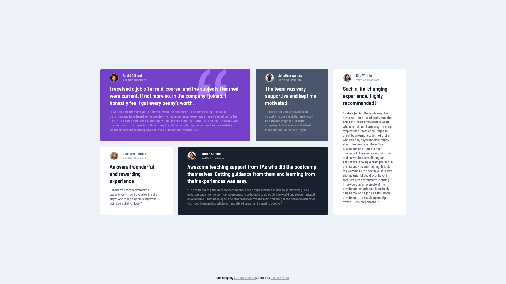
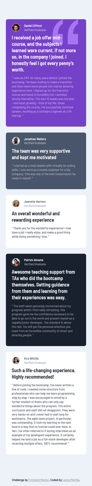

# Frontend Mentor - Testimonials grid section solution

This is a solution to the [Testimonials grid section challenge on Frontend Mentor](https://www.frontendmentor.io/challenges/testimonials-grid-section-Nnw6J7Un7). Frontend Mentor challenges help you improve your coding skills by building realistic projects.

## Table of contents

- [Overview](#overview)
  - [The challenge](#the-challenge)
  - [Screenshot](#screenshot)
- [My process](#my-process)
  - [Built with](#built-with)
  - [What I learned](#what-i-learned)
  - [Continued development](#continued-development)
  - [Useful resources](#useful-resources)
- [Author](#author)
- [Acknowledgments](#acknowledgments)

## Overview

### The challenge

Users should be able to:

- View the optimal layout for the site depending on their device's screen size

### Screenshot

## My process

### Built with

- Semantic HTML5 markup
- Sass custom properties
- Flexbox
- CSS Grid
- Mobile-first workflow

### What I learned

This project was a fun one! I learned a lot about margin-collapse and the reason why it happens, and as well as how grids work. Though centering a div is still quite confusing, I managed to do it, of course with the help of our jolly old pal, W3Schools.

### Continued development

I guess I should be working more on my HTML5 semantics and my Grid game. Grid is pretty powerful when developing a responsive website and I would love to learn more about its amazing features.

**Note: Delete this note and the content within this section and replace with your own plans for continued development.**

### Useful resources

- [W3Schools.com](https://www.w3schools.com/css/css_grid.asp) - This site helped me understand the concepts of Grid and its properties.

## Author

- Website - [Lance Martija](https://github.com/lancemartija)
- Frontend Mentor - [@lancemartija](https://www.frontendmentor.io/profile/lancemartija)
- Twitter - [@lancemartija](https://twitter.com/lancemartija)

## Acknowledgments

Huge thanks to my dad for not beating me up for staying super late because of front-end mentor's challenges. Love you, Dad!